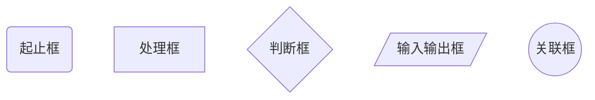

## 程序流程图

> 以简单的图形符号来表示问题求解的步骤  
> 流程图是问题求解的最基本、最重要的分析技术

**常用流程图图形符号**



## 选择语句

```python
# if 语句
"""
if 条件:
    缩进语句块

...
"""
name = "chengbotao"

if name == "chengbotao":
    print("本人")

```

```python
# if-else 语句
"""
if 条件:
    条件为真缩进语句块
else:
    条件为假缩进语句块
"""
name = "chengbotao"

if name == "chengbotao":
    print("本人")
else:
    print("不是本人")
```

```python
# if-elif-...-else 多分支语句
"""
if 条件:
    #todo
elif 条件1:
    #todo1
elif 条件2:
    #todo2
...
else:
    #todo3
"""
score = 90

if score >=90:
    print("A")
elif score >=80:
    print("B")
elif score >=70:
    print("C")
elif score >=60:
    print("D")
else:
    print("E")
```

## 循环语句

```python
# while 语句
"""
# 设定循环可执行的初始条件

while 循环继续条件:
    缩进语句块(#循环体)
    # 设定循环条件改变的语句
...
"""
```

```python
# for ... in 语句
"""
# 依次遍历对象Object中每个元素,并赋值给anElement,然后执行循环体
for anElement in Object:
    缩进语句块(#循环体)
"""
```

### 结束循环的语句

```python
# break 和 continue 语句
count = 0
while count < 5:
    if count > 2:
        break
    print("count:",count)
    count += 1

for i in range(0,6):
    if i > 2:
        break
    print("i:",i)
# break 结束当前循环体


count1 = 0
while count1 < 5:
    count1 += 1
    if count1 < 2:
        continue
    print("count1:",count1)

for j in range(0,6):
    if j < 2:
        continue
    print("j:",j)
# continue 结束当次循环
```

> `while`循环更通用,任何`for`循环都能用`while`实现  
> `for`适用场景,已知循环范围,即起止值和步长  
> `while`适用场景,其他场景,不确定循环何时终止

## 函数

> 完成特定功能的一个语句组,这组语句可以作为一个单位使用,并且给它取一个名字  
> 通过函数名执行

```python
# 函数
"""
定义函数
def fun_name([params]): #关键字 函数名 函数参数(形参)
    #函数体
    return [result] #函数返回,遇到return将终止函数的运行

调用函数
fun_name([params]) #传入实参
"""
```

```python
# 函数-缺省参数
def fun(arg, arg1 = 1,arg2 = 2):
    return arg + arg1 + arg2

fun(1)
fun(1,3)
fun(1,3,4)
```

### 全局变量

> 为整个程序所有使用的变量  
> 所有函数都可以使用

### 局部变量

> 只能在程序特定部分使用的变量  
> 函数内部

```python
# 函数-变量的作用域
globalVar = 1
def fun(arg, arg1 = 1,arg2 = 2):
    localVar = 2
    print("global", globalVar) #1
    print("local",localVar) #2
    return arg + arg1 + arg2

fun(1)
print("global", globalVar) #1
print("local",localVar) #异常

#=========
# 全局跟局部有相同变量时,函数内会优先操作局部变量,不影响全部变量
var = 1
def fun():
    var = 2
    print(var) #2

fun()
print(var) #1

# 函数内需要修改全局变量是,需要使用`global`关键字进行声明,再操作
var = 1
def fun():
    global var
    var = 2
    print(var)#2

fun()
print(var)#2
```

### 函数优点

> **代码可重用:** 提高开发效率;减少重复编码  
> **代码更简洁:** 函数功能相对独立,功能单一,结构清晰,可读性好  
> **编程更容易把握:** 复杂程序分解成小块  
> **封装与信息隐藏**

## 应用示例

**Q:一元二次方程的解**
$$ax^2+bx+c=0$$
$$解为: x=\frac{-b\pm\sqrt{b^2-4ac}}{2a}$$

```python
import math
a = float(input("请输入a:"))
b = float(input("请输入b:"))
c = float(input("请输入c:"))

if a == 0:
    print("不是一个一元二次方程")
else:
    delta = b ** 2 - 4 * a * c
    if delta < 0:
        print("无解")
    elif delta == 0:
        print("有且只有一个解",-b / (2 * a))
    else:
        root = math.sqrt(delta)
        s1 = (-b + root)/(2 * a)
        s2 = (-b - root)/(2 * a)
        print("两个不同的解",s1,s2)
```

**Q:打印乘法表**

```python
for i in range(1,10):
    for j in range(1,10):
        if i>=j:
            print(j,"*",i,"=",i*j,end="")
    print()

```

**Q:判断一个大于 1 的自然数,是否是质数**

> 大于 1 的自然数,除了 1 和它本身外,不能被其他自然数整除

```python
import math
num = int(input("请输入大于1的自然数:"))

for i in range(2, (int(math.sqrt(num)+1))):
    if num%i==0:
        print(num,"不是质数")
        break
else: #这里的else作用,for循环不是正常结束的时候会运行
    print(num,"是质数")
```

**Q:回文数**

> 一个正数顺着和反着都是一样的, 如:`12521`

```python
num = int(input("请输入一个正数:"))
num_t = num
num_p = 0

while num_t != 0:
    num_p = num_p * 10 + num_t % 10
    num_t //= 10

if num_p == num:
    print(num,"是回文数")
else:
    print(num,"不是回文数")
```

**Q:回文素数**

```python
# 是否是回文
def is_palindrome(num):
    num_t = num
    num_p = 0

    while num_t != 0:
        num_p = num_p * 10 + num_t % 10
        num_t //= 10

    if num_p == num:
        return True
    else:
        return False

# 是否是素数
def is_prime(num):
    for i in range(2, num):
        if num%i==0:
            return False
    return True

num = int(input("请输入一个正数:"))
if is_palindrome(num) and is_prime(num):
    print(num,"是回文素数")
else:
    print(num,"不是回文素数")
```

**Q:根据年份和月份得到当前月份的第一天是星期几**

```python
# python 是以1800年1月1日开始 星期三

# 是否是闰年
def is_leap_year(year):
    if year % 400==0 or year%4==0 and year%100!=0:
        return True
    else:
        return False

# 获取当前月份多少天
def get_num_of_days_in_month(year,month):
    if month in (1,3,5,7,8,10,12):
        return 31
    elif month in (4,6,9,11):
        return 30
    elif is_leap_year(year):
        return 29
    else:
        return 28

# 获取1800年到输入年份总共过去多少天
def get_total_num_of_days(year,month):
    days = 0
    for y in range(1800, year):
        if is_leap_year(y):
            days+=366
        else:
            days+=365

    for m in range(1, month):
        days += get_num_of_days_in_month(year,m)

    return days

# 获取月份的第一天是星期几
def get_start_day(year,month):
    return (3 + get_total_num_of_days(year, month)) % 7

year = int(input("请输入年份:"))
month = int(input("请输入月份:"))
print(get_start_day(year,month))
```
